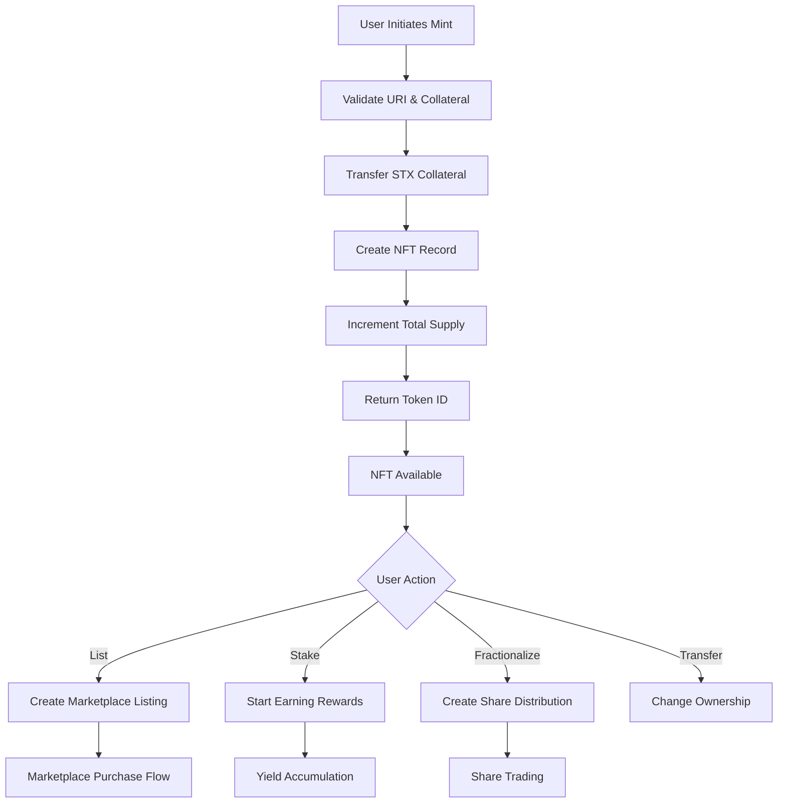
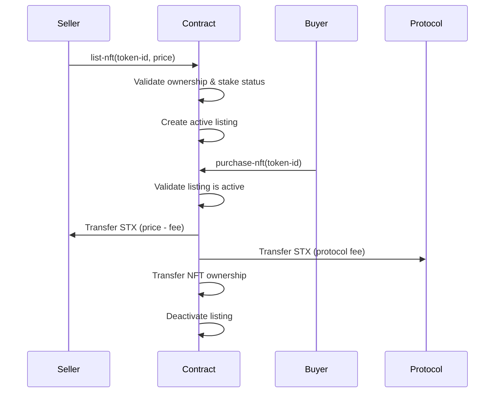
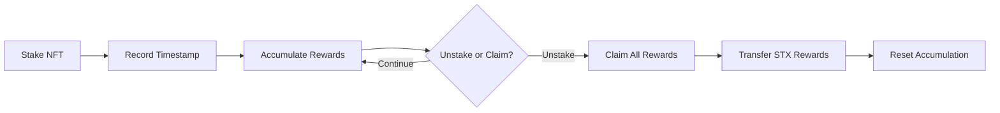

# BlockForge Protocol

**A Next-Generation NFT Infrastructure on Stacks**

[](https://docs.stacks.co/clarity)
[](https://stacks.co)
[](LICENSE)

## Overview

BlockForge is a comprehensive NFT infrastructure protocol built on Stacks that combines digital asset creation, decentralized trading, fractional ownership, and yield-generating staking mechanisms. By leveraging Bitcoin's settlement security through Stacks' smart contracts, BlockForge delivers a trustless marketplace with embedded financial utilities.

### Key Features

- **🏗️ Collateralized NFT Minting** - Mint NFTs backed by STX collateral with configurable ratios
- **🛒 Decentralized Marketplace** - Peer-to-peer NFT trading with protocol fees
- **📊 Fractional Ownership** - Divide NFT ownership into tradeable shares
- **💰 Yield-Generating Staking** - Stake NFTs to earn transparent rewards
- **🔒 Bitcoin-Secured** - Built on Stacks for Bitcoin-level security

## Architecture

### System Overview

```
┌─────────────────┐    ┌─────────────────┐    ┌─────────────────┐
│   NFT Module    │    │ Marketplace     │    │ Staking Module  │
│                 │    │ Module          │    │                 │
│ • Mint          │    │ • List NFTs     │    │ • Stake NFTs    │
│ • Transfer      │    │ • Purchase      │    │ • Calculate     │
│ • Validate      │    │ • Protocol Fees │    │   Rewards       │
└─────────────────┘    └─────────────────┘    └─────────────────┘
         │                       │                       │
         └───────────────────────┼───────────────────────┘
                                 │
                    ┌─────────────────┐
                    │ Fractional      │
                    │ Ownership       │
                    │ Module          │
                    │                 │
                    │ • Share         │
                    │   Management    │
                    │ • Transfer      │
                    │   Shares        │
                    └─────────────────┘
```

### Contract Architecture

#### Core Data Structures

**Tokens Map**

```clarity
tokens: {
  token-id: uint → {
    owner: principal,
    uri: string-ascii,
    collateral: uint,
    is-staked: bool,
    stake-timestamp: uint,
    fractional-shares: uint
  }
}
```

**Marketplace Listings**

```clarity
token-listings: {
  token-id: uint → {
    price: uint,
    seller: principal,
    active: bool
  }
}
```

**Fractional Ownership**

```clarity
fractional-ownership: {
  (token-id, owner): (uint, principal) → {
    shares: uint
  }
}
```

**Staking Rewards**

```clarity
staking-rewards: {
  token-id: uint → {
    accumulated-yield: uint,
    last-claim: uint
  }
}
```

#### Configuration Variables

| Variable | Default | Description |
|----------|---------|-------------|
| `min-collateral-ratio` | 150% | Minimum collateral required for minting |
| `protocol-fee` | 2.5% | Fee charged on marketplace transactions |
| `yield-rate` | 5% | Annual yield rate for staked NFTs |

## Data Flow

### NFT Lifecycle



### Marketplace Transaction Flow



### Staking Reward Mechanism



## API Reference

### Core NFT Functions

#### `mint-nft`

```clarity
(define-public (mint-nft (uri (string-ascii 256)) (collateral uint)))
```

Mints a new NFT with the specified URI and collateral backing.

**Parameters:**

- `uri`: Metadata URI for the NFT (max 256 characters)
- `collateral`: Amount of STX collateral to back the NFT

**Returns:** `(response uint uint)` - Token ID on success

#### `transfer-nft`

```clarity
(define-public (transfer-nft (token-id uint) (recipient principal)))
```

Transfers ownership of an NFT to a new recipient.

**Requirements:**

- Sender must be the current owner
- NFT must not be staked
- Recipient must be valid

### Marketplace Functions

#### `list-nft`

```clarity
(define-public (list-nft (token-id uint) (price uint)))
```

Lists an NFT for sale in the marketplace.

#### `purchase-nft`

```clarity
(define-public (purchase-nft (token-id uint)))
```

Purchases a listed NFT, transferring ownership and handling payments.

### Staking Functions

#### `stake-nft`

```clarity
(define-public (stake-nft (token-id uint)))
```

Stakes an NFT to begin earning yield rewards.

#### `unstake-nft`

```clarity
(define-public (unstake-nft (token-id uint)))
```

Unstakes an NFT, claiming all accumulated rewards.

### Fractional Ownership

#### `transfer-shares`

```clarity
(define-public (transfer-shares (token-id uint) (recipient principal) (share-amount uint)))
```

Transfers fractional shares of an NFT to another user.

### Read-Only Functions

#### `get-token-info`

```clarity
(define-read-only (get-token-info (token-id uint)))
```

Returns comprehensive information about a specific NFT.

#### `calculate-rewards`

```clarity
(define-read-only (calculate-rewards (token-id uint)))
```

Calculates the current accumulated rewards for a staked NFT.

## Error Codes

| Code | Constant | Description |
|------|----------|-------------|
| u100 | `err-owner-only` | Action restricted to contract owner |
| u101 | `err-not-token-owner` | Sender is not the token owner |
| u102 | `err-insufficient-balance` | Insufficient balance for operation |
| u103 | `err-invalid-token` | Token does not exist |
| u104 | `err-listing-not-found` | Marketplace listing not found or inactive |
| u105 | `err-invalid-price` | Price must be greater than zero |
| u106 | `err-insufficient-collateral` | Insufficient STX for collateral requirement |
| u107 | `err-already-staked` | NFT is already staked |
| u108 | `err-not-staked` | NFT is not currently staked |
| u109 | `err-invalid-percentage` | Percentage value out of valid range |
| u110 | `err-invalid-uri` | URI format is invalid |
| u111 | `err-invalid-recipient` | Recipient address is invalid |
| u112 | `err-overflow` | Arithmetic overflow detected |

## Getting Started

### Prerequisites

- [Clarinet](https://github.com/hirosystems/clarinet) for local development
- [Node.js](https://nodejs.org/) v16+ for testing
- [Stacks CLI](https://docs.stacks.co/build-with-stacks/stacks-cli) for deployment

### Installation

1. Clone the repository:

```bash
git clone https://github.com/your-org/block-forge.git
cd block-forge
```

2. Install dependencies:

```bash
npm install
```

3. Run tests:

```bash
npm test
```

### Local Development

Start a local Clarinet environment:

```bash
clarinet console
```

Deploy the contract locally:

```clarity
(contract-call? .block-forge mint-nft "https://example.com/metadata.json" u1000000)
```

### Testing

The project includes comprehensive test coverage using Vitest and Clarinet SDK:

```bash
# Run all tests
npm test

# Run tests with coverage
npm run test:report

# Watch mode for development
npm run test:watch
```

## Security Considerations

### Collateral Management

- All NFTs require STX collateral at a minimum 150% ratio
- Collateral is held by the contract and can be adjusted by governance

### Access Control

- Ownership validation prevents unauthorized transfers
- Staking status prevents transfers during yield generation
- Input validation protects against malformed data

### Economic Security

- Protocol fees ensure sustainable operation
- Yield calculations use block-based time to prevent manipulation
- Overflow protection prevents arithmetic attacks

## Deployment

### Mainnet Deployment

1. Configure your deployment settings in `settings/Mainnet.toml`
2. Deploy using Clarinet:

```bash
clarinet deployments apply -p mainnet
```

### Testnet Deployment

```bash
clarinet deployments apply -p testnet
```

## Contributing

We welcome contributions to BlockForge! Please see our [Contributing Guidelines](CONTRIBUTING.md) for details.

### Development Workflow

1. Fork the repository
2. Create a feature branch
3. Write tests for new functionality
4. Implement the feature
5. Run the test suite
6. Submit a pull request

## License

This project is licensed under the MIT License - see the [LICENSE](LICENSE) file for details.

## Roadmap

- [ ] **Phase 1**: Core NFT and marketplace functionality
- [ ] **Phase 2**: Advanced staking mechanisms and governance
- [ ] **Phase 3**: Cross-chain bridges and Layer 2 scaling
- [ ] **Phase 4**: DAO governance and protocol upgrades
